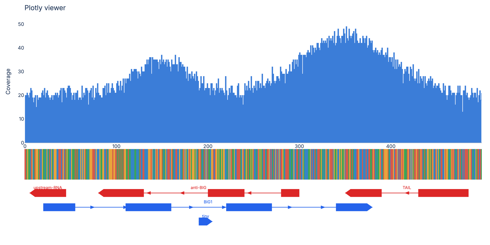

# s2fview

> like IGV in Jupyter notebooks but better

A small Python library for viewing coverage, DNA sequence, and gene
annotations inside a Jupyter notebook. Everything is rendered as a stack
of [Plotly](https://plotly.com/python/) subplots, so all the interaction
(hover, pan, zoom, box-select, autoscale) runs client-side in your
browser — no Python round-trip per mouse move, no lag on remote kernels.



## Status

Prototype. I'm dogfooding this over the next few weeks; expect breakage
and API churn. Not on PyPI yet — install directly from this repo.

## Install

Requires Python ≥ 3.12.

### Option A — `uv` (recommended)

If you don't already have [`uv`](https://docs.astral.sh/uv/), install it
with `curl -LsSf https://astral.sh/uv/install.sh | sh`.

```bash
# Clone and create an isolated venv with all deps
git clone https://github.com/tdsone/s2fview.git
cd s2fview
uv sync

# Launch the demo notebook
uv run jupyter lab notebook.ipynb
```

### Option B — `pip`

```bash
git clone https://github.com/tdsone/s2fview.git
cd s2fview
python -m venv .venv && source .venv/bin/activate
pip install -e .
jupyter lab notebook.ipynb
```

### Option C — install from the GitHub URL into an existing project

```bash
# uv
uv add "git+https://github.com/tdsone/s2fview.git"

# or pip
pip install "git+https://github.com/tdsone/s2fview.git"
```

You'll need a Jupyter front-end (JupyterLab, VS Code's notebook
extension, etc.) that renders Plotly `FigureWidget` outputs. Plain
classic Jupyter Notebook works too.

## Quick start

```python
import numpy as np
from s2fview import Gene, coverage_track

# Synthetic coverage track over 500 bp
rng = np.random.default_rng(0)
positions = np.arange(500)
coverage = (20 + 15 * np.exp(-((positions - 250) ** 2) / (2 * 50**2))
            + rng.normal(0, 2, 500)).clip(0).astype(int)

# Synthetic DNA sequence
sequence = "".join(rng.choice(list("ACGT"), 500))

# A couple of gene annotations
genes = [
    Gene(name="GENE1", start=40, end=220, strand="+",
         exons=((40, 80), (130, 160), (200, 220))),
    Gene(name="GENE2", start=300, end=460, strand="-"),
]

coverage_track(coverage, positions, genes=genes, sequence=sequence,
               title="My region")
```

Drop that into a Jupyter cell and you'll get the full interactive viewer.

## What's in the viewer

- **Coverage track** — filled step area, hover shows position + value.
- **DNA sequence strip** — colored cells per base (`A=green, C=blue,
  G=orange, T=red`), with bold letters that appear when you zoom in
  enough for them to fit.
- **Gene track** — strand-colored boxes (blue `+`, red `−`), directional
  arrow tip on the terminal exon, thin intron lines with chevrons,
  per-gene hover tooltip, gene-name labels. Overlapping genes auto-stack
  into lanes.
- **Hover crosshair** — Plotly's native spike-line, spans every subplot.
- **Built-in toolbar** — pan, zoom, box-select, reset, save-as-PNG.

## Repo layout

```
.
├── notebook.ipynb          # runnable demo
├── src/s2fview/
│   └── __init__.py         # the library — Gene dataclass + coverage_track
├── plots/                  # static snapshots, regenerable from notebook.ipynb
├── pyproject.toml          # deps: anywidget, ipykernel, numpy, plotly
├── features.md             # roadmap notes
└── MILESTONES.md           # design milestones to revisit / roll back to
```

## License

Apache-2.0 (see `LICENSE`).
